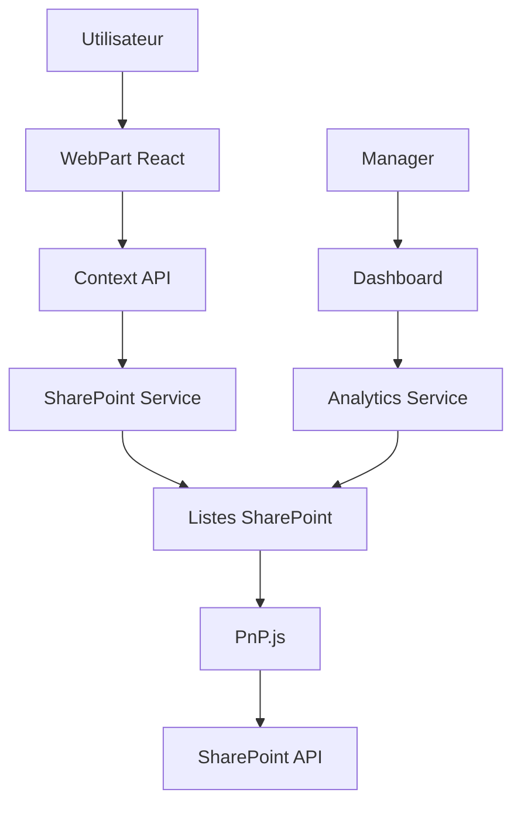

# 🎯 Démarche Compétences CIPREL - Solution SharePoint Framework

[](https://docs.microsoft.com/en-us/sharepoint/dev/spfx/sharepoint-framework-overview)
[](https://reactjs.org/)
[](https://developer.microsoft.com/en-us/fluentui)
[](LICENSE)

Solution SharePoint Framework complète pour la gestion de la démarche compétences chez CIPREL (Compagnie Ivoirienne de Production d'Électricité).

## 📋 Table des matières

- [🎯 Vue d'ensemble](#-vue-densemble)
- [✨ Fonctionnalités](#-fonctionnalités)
- [🛠️ Technologies utilisées](#️-technologies-utilisées)
- [📦 Installation](#-installation)
- [🚀 Déploiement](#-déploiement)
- [📊 Utilisation](#-utilisation)
- [🏗️ Architecture](#️-architecture)
- [🔧 Configuration](#-configuration)
- [👥 Permissions](#-permissions)
- [📚 Documentation](#-documentation)
- [🤝 Contribution](#-contribution)
- [📝 Licence](#-licence)

## 🎯 Vue d'ensemble

Cette solution permet aux collaborateurs de CIPREL de :
- 📊 **Évaluer leurs connaissances** via un quiz interactif
- 💭 **Partager leur opinion** sur la démarche compétences
- 📈 **Suivre leur progression** dans le développement de compétences
- 👨‍💼 **Analyser les résultats** (pour les managers et RH)

### 🎨 Aperçu de l'interface

La solution propose une interface moderne et intuitive avec :
- **Landing Page** : Présentation de la démarche et des bénéfices
- **Quiz Introduction** : 7 questions sur les concepts fondamentaux
- **Sondage Opinion** : 6 questions pour recueillir les attentes
- **Tableau de bord** : Analytics et rapports pour les managers
- **Résultats détaillés** : Feedback personnalisé et recommandations

## ✨ Fonctionnalités

### 🎯 Pour les collaborateurs
- ✅ **Quiz d'évaluation** avec 7 questions catégorisées
- ✅ **Feedback instantané** avec score et recommandations
- ✅ **Sondage d'opinion** pour exprimer attentes et inquiétudes
- ✅ **Suivi de progression** individuel
- ✅ **Interface responsive** (desktop, tablette, mobile)

### 👨‍💼 Pour les managers et RH
- 📊 **Tableau de bord analytique** avec graphiques interactifs
- 📈 **Métriques de performance** par équipe et département
- 📋 **Export des données** pour analyses approfondies
- 🎯 **Identification des besoins** de formation
- 📊 **Rapports de progression** en temps réel

### 🔧 Fonctionnalités techniques
- 🚀 **Déploiement automatisé** via scripts PowerShell
- 📦 **Provisioning automatique** des listes SharePoint
- 🔐 **Gestion des permissions** intégrée
- 💾 **Sauvegarde automatique** des données
- 🌐 **Compatible SharePoint Online** et On-Premises
- 📱 **Progressive Web App** (PWA) ready

## 🛠️ Technologies utilisées

### Frontend
- **SharePoint Framework (SPFx)** 1.21.1 - Framework principal
- **React** 17.0.1 + TypeScript - Interface utilisateur
- **Fluent UI React** v8 - Design system Microsoft
- **React Router DOM** v6 - Navigation SPA
- **Recharts** v2.8 - Graphiques et visualisations

### Backend
- **PnP.js** v3.18.0 - API SharePoint moderne
- **SharePoint Lists** - Stockage des données
- **SharePoint Permissions** - Sécurité native

### DevOps
- **Gulp** 4.0.2 - Build et packaging
- **ESLint** - Qualité du code
- **PowerShell** - Scripts de déploiement
- **Feature Framework** - Provisioning automatique

## 📦 Installation

### Prérequis

Assurez-vous d'avoir installé :

- ✅ **Node.js** v22.14.0+ ([Télécharger](https://nodejs.org/))
- ✅ **npm** v10+ (inclus avec Node.js)
- ✅ **PowerShell** 7+ ([Télécharger](https://github.com/PowerShell/PowerShell))
- ✅ **PnP PowerShell** ([Documentation](https://pnp.github.io/powershell/))
- ✅ **Accès administrateur** à SharePoint Online/On-Premises

### Installation rapide

```bash
# 1. Cloner le repository
git clone https://github.com/votre-org/demarchecompetencesciprel.git
cd demarchecompetencesciprel

# 2. Installer les dépendances
npm install

# 3. Déploiement automatique
.\scripts\quick-start.ps1 -SiteUrl "https://contoso.sharepoint.com/sites/votre-site"
```

### Installation manuelle

<details>
<summary>Cliquez pour voir les étapes détaillées</summary>

```bash
# 1. Installation des dépendances
npm install

# 2. Build de développement
npm run build

# 3. Build de production
npm run build:prod

# 4. Création du package
npm run package

# 5. Déploiement manuel
.\scripts\deploy.ps1 -SiteUrl "https://votre-site.sharepoint.com" -LoadTestData
```

</details>

## 🚀 Déploiement

### Déploiement automatisé (Recommandé)

```powershell
# Déploiement complet avec données de test
.\scripts\quick-start.ps1 -SiteUrl "https://contoso.sharepoint.com/sites/rh"
```

### Déploiement avancé

```powershell
# Déploiement personnalisé
.\scripts\deploy.ps1 `
  -SiteUrl "https://contoso.sharepoint.com/sites/rh" `
  -AppCatalogUrl "https://contoso.sharepoint.com/sites/appcatalog" `
  -LoadTestData `
  -Force
```

### Paramètres disponibles

| Paramètre | Description | Obligatoire |
|-----------|-------------|-------------|
| `-SiteUrl` | URL du site SharePoint cible | ✅ |
| `-AppCatalogUrl` | URL de l'App Catalog (auto-détecté si omis) | ❌ |
| `-LoadTestData` | Charger les questions par défaut | ❌ |
| `-SkipBuild` | Ignorer l'étape de build | ❌ |
| `-Force` | Forcer l'écrasement | ❌ |

## 📊 Utilisation

### 👤 Pour les utilisateurs

1. **Accéder à l'application**
   - Rendez-vous sur votre site SharePoint
   - Localisez la page contenant le WebPart "Démarche Compétences"

2. **Passer le quiz d'introduction**
   - Cliquez sur "Commencer le Quiz"
   - Répondez aux 7 questions (5-10 minutes)
   - Consultez vos résultats détaillés

3. **Répondre au sondage**
   - Cliquez sur "Répondre au Sondage"
   - Partagez vos attentes et inquiétudes
   - Validez vos réponses

### 👨‍💼 Pour les managers

1. **Accéder au tableau de bord**
   - Connectez-vous avec un compte manager/RH
   - Cliquez sur "Tableau de bord" dans la navigation

2. **Analyser les résultats**
   - Consultez les métriques globales
   - Analysez les scores par catégorie
   - Examinez les réponses aux sondages

3. **Exporter les données**
   - Utilisez les fonctions d'export intégrées
   - Générez des rapports personnalisés

## 🏗️ Architecture

### Structure du projet

```
demarchecompetencesciprel/
├── 📁 src/webparts/demarcheCompetences/
│   ├── 🎨 components/          # Composants React
│   │   ├── LandingPage.tsx     # Page d'accueil
│   │   ├── QuizIntroduction.tsx # Interface quiz
│   │   ├── SondageOpinion.tsx  # Interface sondage
│   │   ├── Dashboard.tsx       # Tableau de bord
│   │   └── shared/             # Composants partagés
│   ├── ⚙️ services/           # Services API
│   │   ├── SharePointService.ts # API SharePoint
│   │   ├── QuizService.ts      # Logique quiz
│   │   └── UserService.ts      # Gestion utilisateurs
│   ├── 🧠 contexts/           # State management
│   │   ├── AppContext.tsx      # État global
│   │   └── QuizContext.tsx     # État quiz
│   └── 🎯 types/              # Définitions TypeScript
├── 📦 sharepoint/assets/       # Provisioning
│   └── elements.xml           # Définition listes
├── 🚀 scripts/               # Scripts déploiement
│   ├── deploy.ps1            # Script principal
│   └── quick-start.ps1       # Installation rapide
└── 📚 docs/                  # Documentation
```

### Flux de données



### Listes SharePoint créées

| Liste | Description | Champs principaux |
|-------|-------------|-------------------|
| **CompetenceQuestions** | Questions des quiz | Question, Options A/B/C, Réponse correcte, Catégorie |
| **CompetenceResults** | Résultats des quiz | UserId, Score, Réponses, Durée |
| **SondageResponses** | Réponses sondages | UserId, Q1-Q6, Date soumission |

## 🔧 Configuration

### Variables d'environnement

Aucune configuration spéciale requise. La solution utilise :
- L'authentification SharePoint native
- Les permissions SharePoint standard
- Le stockage dans les listes SharePoint

### Personnalisation

<details>
<summary>Modifier les questions du quiz</summary>

1. Accédez à la liste "Questions Compétences" dans SharePoint
2. Ajoutez/modifiez les questions via l'interface SharePoint
3. Respectez la structure des champs définie

</details>

<details>
<summary>Personnaliser l'apparence</summary>

1. Modifiez le fichier `src/components/DemarcheCompetences.module.scss`
2. Ajustez les couleurs CIPREL dans la constante `ciprelTheme`
3. Rebuild et redéployez la solution

</details>

## 👥 Permissions

### Permissions requises

| Rôle | Permissions SharePoint | Accès |
|------|----------------------|-------|
| **Utilisateur standard** | Lecture/Écriture sur les listes | Quiz + Sondage |
| **Manager/RH** | Lecture complète + permissions élevées | Tableau de bord |
| **Administrateur** | Contrôle total | Configuration |

### Configuration des permissions

Les permissions sont configurées automatiquement lors du déploiement. Pour les ajuster manuellement :

1. Accédez aux paramètres du site SharePoint
2. Gérez les permissions des listes créées
3. Configurez les groupes d'utilisateurs selon vos besoins

## 📚 Documentation

### Guides détaillés

- 📖 [Guide d'installation](docs/INSTALLATION.md)
- 👤 [Guide utilisateur](docs/USER_GUIDE.md)
- 👨‍💼 [Guide manager](docs/MANAGER_GUIDE.md)
- 🔧 [Guide technique](docs/TECHNICAL_GUIDE.md)
- 🔧 [API Documentation](docs/API.md)

### Dépannage

Consultez notre [FAQ et résolution de problèmes](docs/TROUBLESHOOTING.md) pour les problèmes courants.

### Support

- 💬 [Issues GitHub](https://github.com/votre-org/demarchecompetencesciprel/issues)
- 📧 Email support : support@ciprel.ci
- 📞 Hotline : +225 XX XX XX XX XX

## 🔄 Mise à jour

### Version actuelle : 1.0.0

```bash
# Vérifier les mises à jour
git pull origin main
npm install

# Redéployer
npm run deploy
.\scripts\deploy.ps1 -SiteUrl "votre-url" -Force
```

### Historique des versions

- **v1.0.0** (2024-12) : Version initiale avec toutes les fonctionnalités de base

## 🤝 Contribution

Nous accueillons les contributions ! Consultez notre [guide de contribution](CONTRIBUTING.md).

### Développement local

```bash
# Installation développement
npm install
npm start

# Tests et qualité
npm run lint
npm run test

# Build production
npm run deploy
```

### Standards de code

- ✅ TypeScript strict mode
- ✅ ESLint + Prettier
- ✅ Tests unitaires avec Jest
- ✅ Documentation JSDoc

## 📈 Roadmap

### Version 1.1 (Q1 2025)
- 🔄 Synchronisation avec Active Directory
- 📊 Rapports avancés avec Power BI
- 🌍 Support multi-langues (FR/EN)
- 📱 Application mobile dédiée

### Version 1.2 (Q2 2025)
- 🤖 IA pour recommandations personnalisées
- 🔗 Intégration Microsoft Teams
- 📚 Modules e-learning intégrés
- ⚡ Performance optimizations

## 📝 Licence

Ce projet est sous licence MIT. Voir le fichier [LICENSE](LICENSE) pour plus de détails.

---

## 🙏 Remerciements

- **CIPREL** - Pour le soutien et les spécifications
- **Microsoft** - Pour SharePoint Framework et Fluent UI
- **PnP Community** - Pour les outils et bibliothèques
- **L'équipe de développement** - Pour leur travail acharné

---

<div align="center">

**💡 Développé avec ❤️ pour CIPREL**

[🌐 Site web](https://ciprel.ci) • [📧 Contact](mailto:contact@ciprel.ci) • [📱 LinkedIn](https://linkedin.com/company/ciprel)

</div>